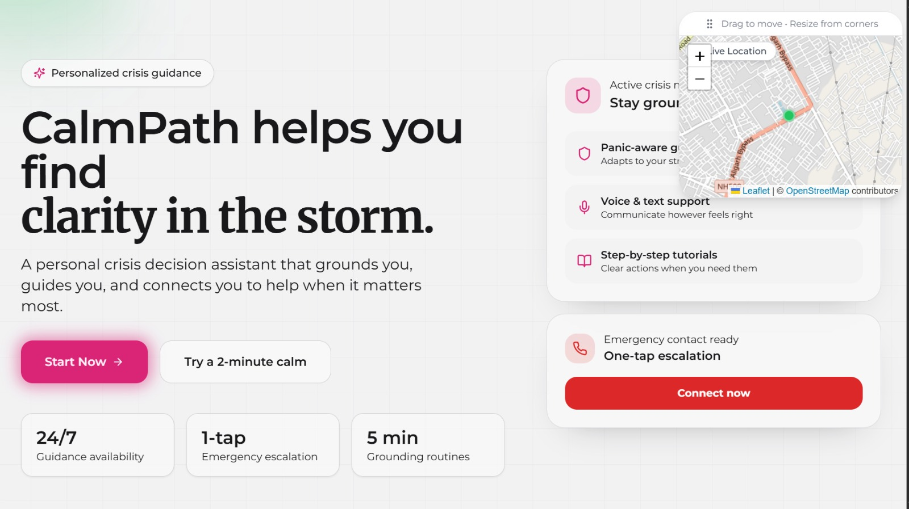
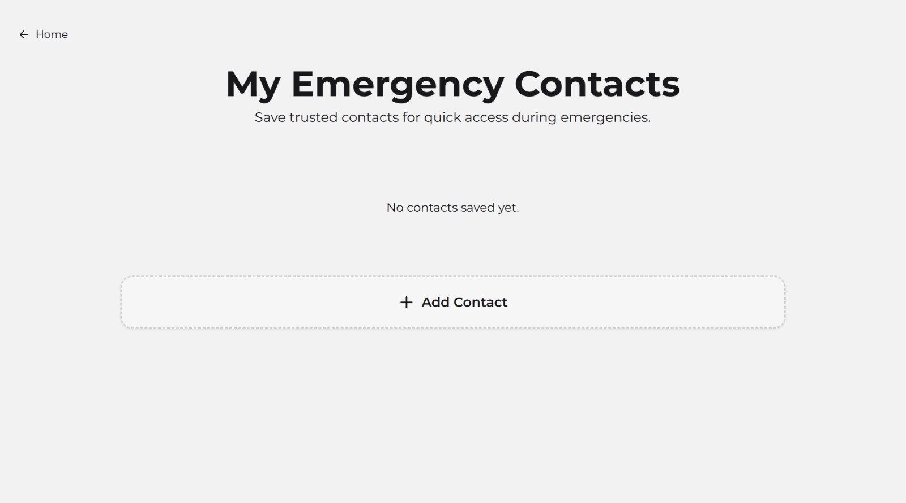
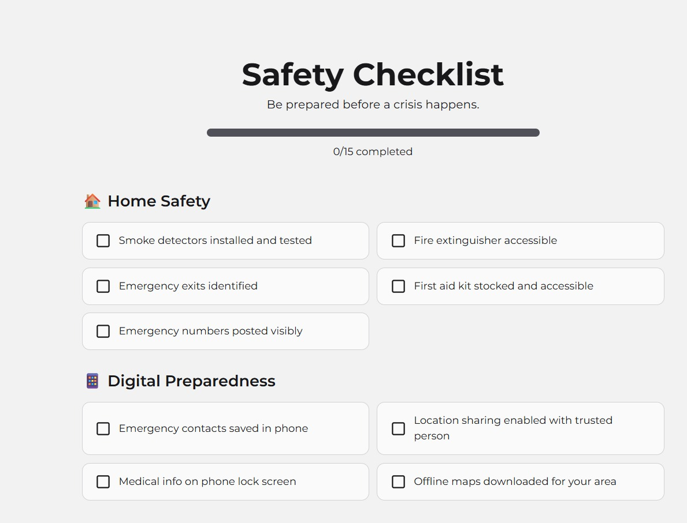
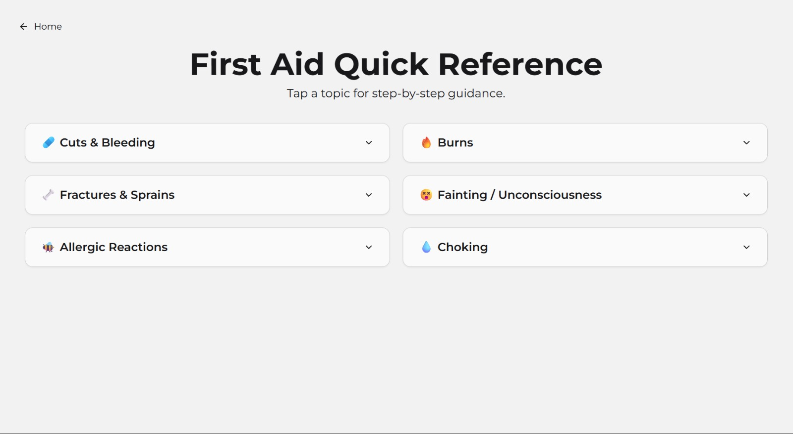
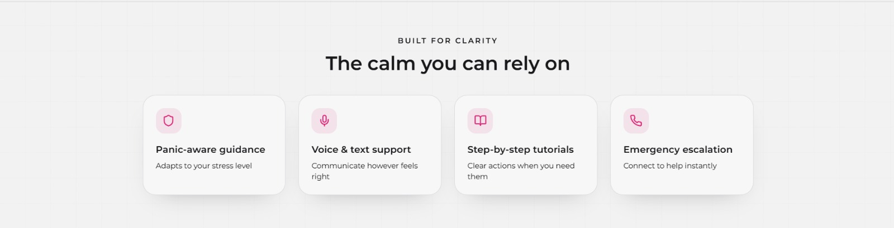
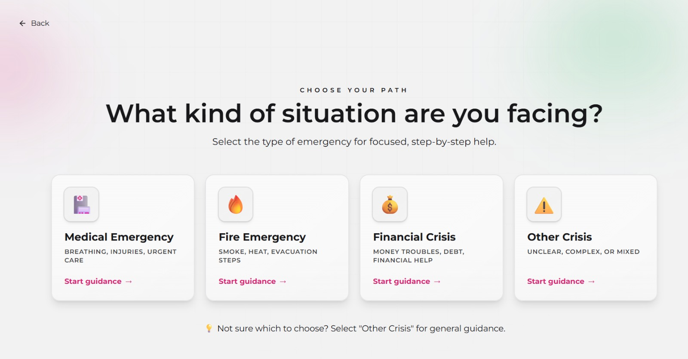
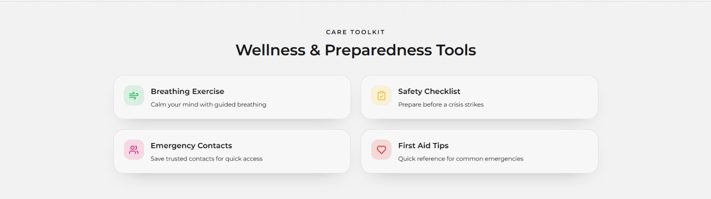
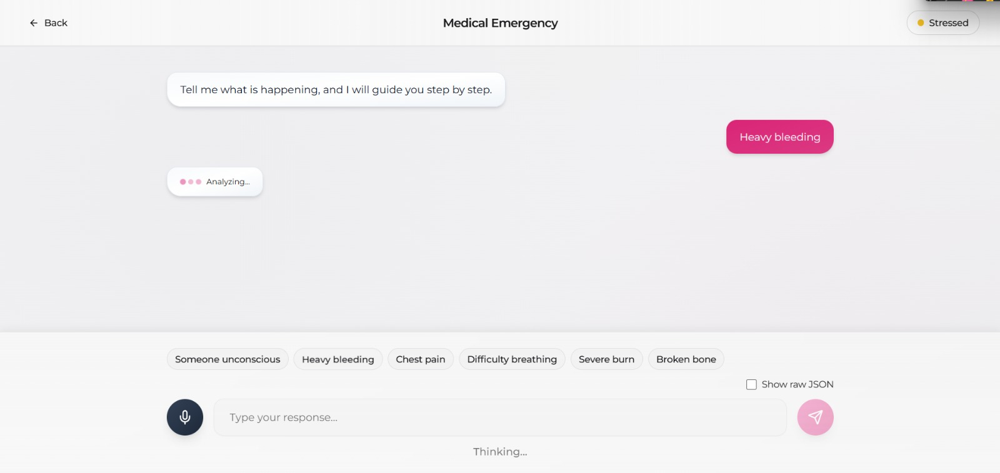

# CalmPath - Personal Crisis Decision Assistant

> *Your compassionate guide through emergencies - helping you find clarity when it matters most.*

CalmPath is a modern, mobile-first crisis management application designed to help people manage emergencies with clear guidance and emotional support. Built with React, TypeScript, and powered by an intuitive AI-like conversational interface, CalmPath provides step-by-step instructions, calming techniques, and emergency escalation support during high-stress situations.



## Quick Start

```bash
# Clone and install
git clone https://github.com/rupeshv2121/CalmPath_Frontend.git
cd CalmPath_Frontend
npm install

# Configure backend (optional)
echo "VITE_MEDICAL_API_URL=http://localhost:8000" > .env

# Start development
npm run dev
```

Visit `http://localhost:5173`

## Table of Contents

- [Feature Highlights](#-feature-highlights)
- [Key Features](#key-features)
- [Application Pages](#application-pages)
- [Tech Stack](#tech-stack)
- [Getting Started](#getting-started)
- [Project Structure](#project-structure)
- [Configuration](#configuration)
- [Application Flow](#application-flow)
- [Browser Compatibility](#browser-compatibility)
- [Deployment](#deployment)
- [UI/UX Features](#uiux-features)
- [Performance & Technical Details](#performance--technical-details)
- [Troubleshooting](#troubleshooting)
- [Testing](#-testing)
- [Contributing](#-contributing)
- [Future Enhancements](#future-enhancements)
- [Technology Stack Summary](#-technology-stack-summary)
- [Useful Links](#-useful-links)

## Feature Highlights

-  **5 Crisis Types**: Medical, Fire, Safety, Financial, Other
-  **AI Medical Assessment**: Real-time backend integration with structured output
-  **Voice Input**: Hindi & English speech recognition with auto-translation
-  **Streaming Responses**: Natural typing effects for conversational feel
-  **Dynamic Panic Levels**: Auto-updates based on severity (Critical → Panic)
-  **Guided Tutorials**: Dynamic step-by-step instructions from AI assessment
-  **Financial Support**: Debt counseling and resource links
-  **Breathing Exercises**: 3 scientifically-backed calming patterns


-  **Emergency Contacts**: Persistent contact management



-  **Safety Checklist**: Track home, digital, and go-bag preparedness



-  **First Aid Tips**: Quick accordion reference for common emergencies



-  **Progressive Animations**: Smooth, staggered UI reveals
-  **Fully Responsive**: Mobile-first design with touch optimization



## Key Features

### Crisis Guidance System
- **Multi-Crisis Support**: Handle Medical, Fire, Financial, and Other emergencies
- **AI-Powered Medical Assessment**: Real-time backend integration for medical crisis evaluation
- **Financial Crisis Support**: Debt counseling, resource links, and financial guidance
- **Intelligent Chat Interface**: Natural conversational flow with streaming text effects
- **Panic-Level Tracking**: Real-time monitoring of stress levels (Calm → Stressed → Panic)
- **Dynamic Severity Detection**: Automatic panic level updates based on medical assessment severity (Critical/High/Moderate/Low)
- **Structured Assessment Display**: Color-coded sections for assessment, actions, warnings, escalation, and reassurance



### Multimodal Communication
- **Voice Input**: Hands-free interaction using Web Speech API
- **Multi-Language Support**: Hindi and English speech recognition
- **Real-time Translation**: Hindi-to-English translation using MyMemory API
- **Text-to-Speech**: Audio playback of tutorial instructions for accessibility

### Interactive Tutorials
- **Step-by-Step Instructions**: Clear, timed guidance for each crisis type
- **Dynamic Medical Actions**: AI-generated tutorial steps from backend assessment
- **Audio Instructions**: Voice-guided steps for hands-free operation
- **Progress Tracking**: Visual indicators showing current step and completion status
- **Timer Integration**: Built-in timers for critical time-sensitive actions
- **Critical Action Highlighting**: Visual indicators for urgent steps

### Wellness & Calming Tools
- **Guided Breathing Exercises**: 3 scientifically-backed breathing patterns
  - Box Breathing (4-4-4-4)
  - 4-7-8 Breathing
  - Quick Calm (2-3-4)
- **Animated Visual Guides**: Breathing circle that scales with inhale/exhale cycles
- **Emergency Contacts Manager**: Save and manage trusted contacts with persistent storage
- **Safety Checklist**: Track preparedness across Home Safety, Digital Prep, and Go-Bag items
- **First Aid Quick Reference**: Accordion-style tips for common emergencies (cuts, burns, choking, CPR, etc.)



### Medical Assessment Features
- **Real-time Backend Integration**: FastAPI backend for medical crisis evaluation
- **Severity Classification**: Critical, High, Moderate, Low severity indicators
- **Immediate Action Steps**: Numbered, ordered steps with critical flags
- **Safety Warnings**: "Do NOT Do" warnings to prevent dangerous actions
- **Escalation Alerts**: Automatic detection when emergency services are needed
- **Reassurance Messages**: Calming emotional support throughout the crisis
- **Debug Mode**: Raw JSON toggle for testing and development

### Emergency Features
- **One-Tap Emergency Escalation**: Quick access when situations worsen
- **Direct Emergency Contacts**: Phone links to emergency services (102/101/100/112)
- **Live Location Sharing**: Geolocation API integration for sharing your location
- **Post-Crisis Re-Evaluation**: "Is the situation under control?" assessment flow

### Data Persistence
- **LocalStorage Integration**: Saves emergency contacts and safety checklist progress
- **Session Continuity**: Maintains user data across browser sessions

## Application Pages

| Page | Route | Description |
|------|-------|-------------|
| **Landing Page** | `/` | Hero section, feature highlights, usage stats, and wellness tool links |
| **Crisis Selection** | `/select` | Choose your emergency type (Medical/Fire/Safety/Financial/Other) with improved card UI |
| **AI Chat Assistant** | `/chat/:crisisType` | Medical/Financial assessment with backend integration, voice input, streaming responses |
| **Tutorial Guide** | `/tutorial/:crisisType` | Step-by-step visual instructions with audio, timers, and critical action alerts |
| **Re-Evaluation** | `/evaluate` | Post-tutorial assessment with escalation decision |
| **Emergency Escalation** | `/emergency` | Direct emergency service contacts and location sharing |
| **Breathing Exercise** | `/breathe` | Guided breathing patterns with visual animations |
| **Safety Checklist** | `/checklist` | Preparedness checklist with progress tracking |
| **Emergency Contacts** | `/contacts` | Manage trusted emergency contacts |
| **First Aid Tips** | `/first-aid` | Quick-reference accordion for common emergencies |
| **404 Not Found** | `/*` | Error page for invalid routes |

## Tech Stack

### Core Framework
- **React 18.3** - Modern UI library with hooks and concurrent features
- **TypeScript 5.8** - Type-safe development
- **Vite 5.4** - Lightning-fast build tool with HMR
- **React Router 6.30** - Client-side routing

### Styling & UI
- **Tailwind CSS 3.4** - Utility-first CSS framework
- **Shadcn/ui** - Beautifully designed component library built on Radix UI
- **Framer Motion 12.34** - Production-ready animation library
- **Lucide React** - Beautiful, consistent icon set (462+ icons)
- **Next-themes** - Dark mode support

### State & Forms
- **React Query 5.83** - Server state management and caching
- **React Hook Form 7.61** - Performant form handling
- **Zod 3.25** - TypeScript-first schema validation

### UI Components (Shadcn/ui)
Over 48 accessible, customizable components including:
- **Form Controls**: input, textarea, select, checkbox, radio-group, switch, slider
- **Overlays**: dialog, drawer, alert-dialog, popover, tooltip, hover-card, sheet
- **Navigation**: breadcrumb, navigation-menu, menubar, tabs, dropdown-menu, pagination
- **Data Display**: table, accordion, carousel, card, badge, avatar, progress
- **Feedback**: alert, toast, sonner, skeleton, command

### Browser APIs
- **Web Speech API** - Speech recognition for voice input
- **Geolocation API** - Location sharing for emergency services
- **Web Audio API** - Text-to-speech synthesis
- **LocalStorage API** - Persistent data storage

### External APIs
- **MyMemory Translation API** - Hindi-to-English translation for voice input
- **Backend Medical API** - FastAPI server for medical/financial crisis assessment
  - `/medical` - Medical emergency evaluation
  - `/chat` - Financial crisis guidance

### Development Tools
- **ESLint 9.32** - Code linting with TypeScript support
- **Vitest 3.2** - Fast unit testing framework
- **Testing Library** - React component testing
- **PostCSS** - CSS processing with Autoprefixer
- **Vercel** - Deployment platform

## Getting Started

### Prerequisites
- **Node.js** 18+ (recommended: 20 LTS)
- **npm** 9+ or **yarn** 1.22+
- Modern web browser with Speech API support (Chrome, Edge, Safari)

### Installation

1. **Clone the repository**
   ```bash
   git clone https://github.com/rupeshv2121/CalmPath_Frontend.git
   cd CalmPath_Frontend
   ```

2. **Install dependencies**
   ```bash
   npm install
   ```

3. **Configure environment** (optional - for backend integration)
   ```bash
   # Create .env file
   echo "VITE_MEDICAL_API_URL=http://localhost:8000" > .env
   ```

4. **Start development server**
   ```bash
   npm run dev
   ```
   The app will open at `http://localhost:5173`

## Project Structure

```
CalmPath_Frontend/
├── src/
│   ├── components/          # Reusable UI components
│   │   ├── ui/             # Shadcn/ui component library (48+ components)
│   │   ├── ChatBubble.tsx  # Animated chat message bubbles with streaming cursor
│   │   ├── MedicalAssessmentBubble.tsx  # Structured medical assessment display
│   │   ├── PanicIndicator.tsx  # Real-time panic level display (Calm/Stressed/Panic)
│   │   ├── TimerComponent.tsx  # Step-by-step countdown timer
│   │   ├── CrisisCard.tsx  # Selectable crisis type cards with hover effects
│   │   ├── LiveLocationMap.tsx  # Emergency location sharing component
│   │   └── PageWrapper.tsx # Consistent page layout wrapper
│   ├── pages/              # Application pages (11 routes)
│   │   ├── Index.tsx       # Landing page
│   │   ├── CrisisSelection.tsx
│   │   ├── ChatBot.tsx
│   │   ├── Tutorial.tsx
│   │   ├── ReEvaluation.tsx
│   │   ├── EmergencyEscalation.tsx
│   │   ├── BreathingExercise.tsx
│   │   ├── SafetyChecklist.tsx
│   │   ├── EmergencyContacts.tsx
│   │   ├── FirstAidTips.tsx
│   │   └── NotFound.tsx
│   ├── hooks/              # Custom React hooks
│   │   ├── use-mobile.tsx  # Responsive breakpoint detection
│   │   └── use-toast.tsx   # Toast notification management
│   ├── lib/                # Utility functions
│   │   └── utils.ts        # cn() for class merging
│   ├── App.tsx             # Root component with router
│   ├── main.tsx            # Application entry point
│   └── index.css           # Global styles and Tailwind imports
├── public/                 # Static assets
├── dist/                   # Production build output (generated)
├── components.json         # Shadcn/ui configuration
├── tailwind.config.js      # Tailwind CSS configuration
├── vite.config.ts          # Vite build configuration
├── tsconfig.json           # TypeScript configuration
├── vercel.json             # Vercel deployment config
└── package.json            # Project dependencies and scripts
```

## Application Flow

### Medical/Financial Crisis Flow
```
Landing Page (/)
    ↓
Crisis Selection (/select)
    ↓
AI Chat Assistant (/chat/medical or /chat/financial)
    ├─ Voice/Text Input with Hindi-English translation
    ├─ Backend API call for assessment
    ├─ Streaming response with progressive animations
    └─ Structured assessment display:
        ├─ Crisis Type & Severity Badge
        ├─ Assessment Summary (blue box)
        ├─ Immediate Action Steps (with critical flags)
        ├─ Do NOT Do Warnings (yellow alerts)
        ├─ Escalation Alert (if required - red box)
        ├─ Reassurance Message (green box)
        ├─ Financial Resources (if applicable)
        └─ "Start Guided Tutorial" Button
    ↓
Tutorial Guide (/tutorial/medical) ← Dynamic steps from assessment
    ↓
Re-Evaluation (/evaluate) ← "Is situation under control?"
    ↓
[If escalation needed]
Emergency Escalation (/emergency) ← Direct emergency contacts
```

### Other Crisis Types Flow (Fire/Safety/Other)
```
Crisis Selection (/select)
    ↓
AI Chat Assistant (/chat/:type) ← Predefined conversation flow
    ↓
Tutorial Guide (/tutorial/:type) ← Predefined steps
```

### Wellness Tools (Accessible Anytime)
- `/breathe` - Guided breathing exercises
- `/checklist` - Safety preparedness
- `/contacts` - Emergency contact management
- `/first-aid` - Quick first aid reference

## Configuration

### Environment Variables
Create a `.env` file in the root directory:

```env
# Backend API URL (required for medical/financial crisis features)
VITE_MEDICAL_API_URL=http://localhost:8000

# Production
# VITE_MEDICAL_API_URL=https://your-backend.onrender.com
```

### Backend API Requirements
The frontend expects a FastAPI backend with the following endpoints:

**Medical Assessment Endpoint**
```
POST /medical
Body: { "user_input": "Patient description", "session_id": "optional-uuid" }

Response: {
  "crisis_type": "Trauma",
  "severity_level": "critical",
  "assessment": "Assessment text...",
  "immediate_actions": [
    {
      "step_id": 1,
      "title": "Action title",
      "instruction": "Detailed instruction",
      "critical": true,
      "duration_seconds": 30
    }
  ],
  "do_not_do": ["Warning 1", "Warning 2"],
  "escalation": {
    "required": true,
    "who_to_contact": ["Emergency Services (112)"],
    "reason": "Critical condition"
  },
  "reassurance_message": "Calming message..."
}
```

**Financial Crisis Endpoint**
```
POST /chat
Body: { "user_input": "Financial situation", "session_id": "optional-uuid" }

Response: (Same structure as medical with financial_resources array)
```

**Health Check Endpoint** (recommended)
```
GET /health
Response: { "status": "healthy", "version": "1.0.0" }
```

### Integrating a Custom Backend

1. **Update Environment Variable**
   ```bash
   # .env
   VITE_MEDICAL_API_URL=https://your-custom-backend.com
   ```

2. **CORS Configuration Required**
   Backend must allow requests from frontend origin:
   ```python
   # Python/FastAPI example
   from fastapi.middleware.cors import CORSMiddleware
   
   app.add_middleware(
       CORSMiddleware,
       allow_origins=["http://localhost:5173", "https://your-frontend.vercel.app"],
       allow_methods=["POST", "GET"],
       allow_headers=["*"],
   )
   ```

3. **Response Format**
   Ensure your backend returns JSON matching the `AssessmentResponse` interface

## Building for Production

### Standard Build
```bash
npm run build
```
Outputs to `dist/` directory with optimized assets:
- Minified JavaScript bundles
- Optimized CSS
- Asset hashing for cache busting
- Tree-shaking for minimal bundle size

### Development Build
```bash
npm run build:dev
```
Builds with source maps and less aggressive optimizations for debugging.

### Preview Production Build
```bash
npm run preview
```
Serves the production build locally at `http://localhost:5173`

## Deployment

### Deploy to Vercel

**Option 1: One-Click Deploy**

[](https://vercel.com/new/clone?repository-url=https://github.com/rupeshv2121/CalmPath_Frontend)

**Option 2: Manual Deploy via CLI**

```bash
# Install Vercel CLI
npm i -g vercel

# Deploy
vercel

# Production deployment
vercel --prod
```

**Option 3: GitHub Integration**

1. Push code to GitHub
2. Visit [vercel.com](https://vercel.com)
3. Import your repository
4. Configure environment variables:
   - `VITE_MEDICAL_API_URL` → Your backend URL
5. Deploy automatically on push

### Environment Variables for Production

In Vercel dashboard → Settings → Environment Variables:

```
VITE_MEDICAL_API_URL=https://your-backend.onrender.com
```

### Build Settings (Vercel)

- **Framework Preset**: Vite
- **Build Command**: `npm run build`
- **Output Directory**: `dist`
- **Install Command**: `npm install`
- **Node Version**: 18.x

## UI/UX Features

### Progressive Animations
- **Crisis Cards**: Staggered entrance with scale animations and hover effects
- **Chat Messages**: Fade-in with typing cursor for streaming text

- **Medical Assessment**: Sequential section reveals (0.3s intervals)
  - Crisis badges → Assessment → Actions → Warnings → Escalation → Reassurance → Resources
- **Action Steps**: Individual item animations (0.15s stagger)
- **Border Pulse**: Subtle color pulse on assessment container
- **Loading States**: Animated dots with "Analyzing..." indicator

### Color Coding System
- **Blue** - Assessment information
- **Red** - Critical actions, escalation alerts
- **Yellow** - Warnings, "Do NOT Do" items
- **Green** - Reassurance, safety confirmation
- **Gray** - Standard actions, neutral content

### Responsive Design
- Mobile-first approach with breakpoints:
  - `sm:` 640px - Small tablets
  - `md:` 768px - Tablets
  - `lg:` 1024px - Laptops
  - `xl:` 1280px - Desktops
  - `2xl:` 1536px - Large displays
- Touch-optimized buttons and inputs
- Collapsible quick preset menu on mobile
- Adaptive grid layouts for crisis cards

## Future Enhancements

- **Multi-language Support**:  Hindi-English voice input implemented
- **Financial Crisis Support**:  Debt counseling and resources added
- **Analytics Dashboard**: Track usage patterns and crisis types
- **Push Notifications**: Browser notifications for safety alerts
- **Account System**: User profiles and crisis history
- **Mobile App**: Native iOS/Android versions
- **Hospital Finder**: Nearby hospital locator with directions
- **Ride Booking**: Integrated emergency transportation
- **Crisis Logs**: Save and review past emergency responses
- **Offline Mode**: Progressive Web App with service workers
- **Video Call Support**: Direct video consultation with professionals

## Technology Stack Summary

| Category | Technologies |
|----------|-------------|
| **Frontend Framework** | React 18.3, TypeScript 5.8 |
| **Build Tool** | Vite 5.4 |
| **Routing** | React Router 6.30 |
| **Styling** | Tailwind CSS 3.4, Shadcn/ui |
| **Animations** | Framer Motion 12.34 |
| **State Management** | React Hooks, React Query 5.83 |
| **Forms** | React Hook Form 7.61, Zod 3.25 |
| **Icons** | Lucide React (462+) |
| **Speech** | Web Speech API |
| **Translation** | MyMemory API |
| **Backend API** | FastAPI (Python) |
| **Deployment** | Vercel |
| **Testing** | Vitest 3.2, Testing Library |

## Useful Links

- **Frontend Repository**: [https://github.com/rupeshv2121/CalmPath_Frontend](https://github.com/rupeshv2121/CalmPath_Frontend)
- **Backend Repository**: [https://github.com/your-org/CalmPath_Backend](https://github.com/your-org/CalmPath_Backend) *(update link)*
- **Live Demo**: [https://calm-path-frontend.vercel.app](https://calm-path-frontend.vercel.app) *(if deployed)*
- **Issues & Bugs**: [Report here](https://github.com/rupeshv2121/CalmPath_Frontend/issues)
- **Feature Requests**: [Suggest features](https://github.com/rupeshv2121/CalmPath_Frontend/issues/new)

---

<div align="center">

### Made with ❤️ by Team 4Unknowns

**CalmPath** - *Because clarity matters when every second counts*

[](https://reactjs.org/)
[](https://www.typescriptlang.org/)
[](https://vitejs.dev/)
[](https://tailwindcss.com/)

**AMUHacks5 Submission** | 2026

</div>
